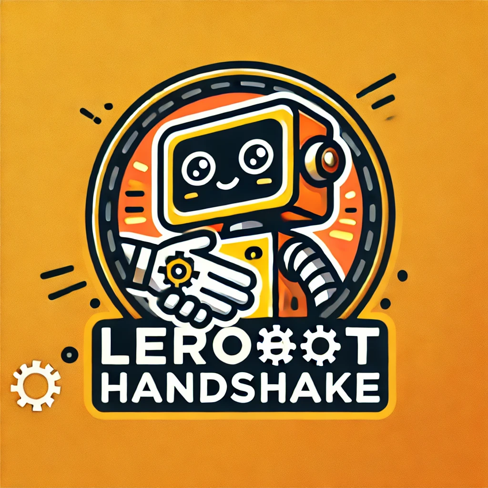

# 🤝 LeRobot SO-101 Handshake Project

<p align="center">
  <div style="display: flex; align-items: center; justify-content: center; gap: 20px;">
  <picture>
    <source media="(prefers-color-scheme: dark)" srcset="media/lerobot-logo-thumbnail.png">
    <source media="(prefers-color-scheme: light)" srcset="media/lerobot-logo-thumbnail.png">
      
  </picture>
    
  </div>
  <br/>
  <br/>
</p>

<div align="center">

[](https://www.python.org/downloads/)
[](https://github.com/huggingface/lerobot/blob/main/LICENSE)
[](https://github.com/huggingface/lerobot)

</div>

<h2 align="center">
    <p>🤖 Teaching SO-101 Robot Arms to Shake Hands with Humans 🤝</p>
</h2>

<div align="center">
  <div style="display: flex; gap: 1rem; justify-content: center; align-items: center;" >
    
    
  </div>

  <p><strong>Watch your SO-101 robot learn to detect handshake gestures and respond naturally!</strong></p>
  <p>Train it with your own demonstrations in minutes. 🚀</p>
  <p>Built on the powerful LeRobot framework with custom handshake detection. 🤝</p>
</div>

---

## 🎯 Project Overview

This project extends LeRobot to enable SO-101 robots to:

1. **🔍 Detect handshake gestures** using computer vision
2. **🎯 Recognize when humans are ready** to shake hands  
3. **🤖 Learn handshake motions** through teleoperation demonstrations
4. **🤝 Perform autonomous handshakes** with humans

### ✨ Key Features

- **Handshake Detection**: Real-time computer vision to detect when a person extends their hand
- **Single Camera Setup**: Optimized for front-facing camera (unlike standard SO-101 dual-camera setup)
- **Custom Recording Pipeline**: Specialized data collection for handshake interactions
- **Adaptive Training**: Policies that learn to correlate visual cues with appropriate actions
- **Safety-First**: Built-in safeguards and confidence thresholds

---

## 🛠️ Hardware Requirements

### Essential Hardware
- **2x SO-101 Robot Arms** (Leader + Follower) - [Build Guide](https://huggingface.co/docs/lerobot/so101)
  - Leader arm: For teleoperation during training
  - Follower arm: Performs the actual handshake
- **1x Camera** (USB webcam or similar)
  - Positioned to view the interaction area
  - 640x480 resolution minimum (higher resolution recommended)
- **Development Computer** with USB ports for robot arms and camera

### Software Requirements  
- **Python 3.10+**
- **LeRobot Framework** (included in this project)
- **OpenCV** for camera handling
- **MediaPipe** for hand detection (part of handshake detection module)

---

## 🚀 Quick Setup

### 1. Installation

Clone this repository:
```bash
git clone https://github.com/Jackson1356/lerobot_handshake.git
cd lerobot_handshake
```

Create and activate a virtual environment:
```bash
conda create -y -n lerobot_handshake python=3.10
conda activate lerobot_handshake
```

Install dependencies:
```bash
conda install ffmpeg -c conda-forge
pip install -e .
```

### 2. Hardware Setup

1. **Build your SO-101 arms** following the [official guide](https://huggingface.co/docs/lerobot/so101)
2. **Connect your camera** and note its device index (usually 0)
3. **Find robot ports**:
   ```bash
   python -m lerobot.find_port
   ```
4. **Test camera connection**:
   ```bash
   python -m lerobot.find_cameras opencv
   ```

### 3. Setup Motors

Before calibration, set unique IDs and baudrates for each motor (only needed once):

```bash
# Setup follower arm motors
python -m lerobot.setup_motors \
    --robot.type=so101_follower \
    --robot.port=/dev/ttyACM1

# Setup leader arm motors  
python -m lerobot.setup_motors \
    --teleop.type=so101_leader \
    --teleop.port=/dev/ttyACM0
```

**Motor Setup Process**: Connect each motor individually to the controller board when prompted. The script will automatically assign IDs and set the correct baudrate.

### 4. Calibrate Your Robots

Calibrate both leader and follower arms following the [official SO-101 calibration guide](https://huggingface.co/docs/lerobot/so101#calibrate):
```bash
# Calibrate follower arm
python -m lerobot.calibrate \
    --robot.type=so101_follower \
    --robot.port=/dev/ttyACM1 \
    --robot.id=my_follower_arm

# Calibrate leader arm  
python -m lerobot.calibrate \
    --teleop.type=so101_leader \
    --teleop.port=/dev/ttyACM0 \
    --teleop.id=my_leader_arm
```

**Calibration Process**: The script will guide you to:
1. Position each arm in the middle of its joint ranges
2. Move each joint through its full range of motion when prompted
3. This ensures both arms have matching position values for training

**The calibration json files are saved to /home/.cache/huggingface/lerobot/calibration**

### 5. Manual Teleoperation

Practice controlling your robot before recording datasets.

1. Without Camera
```bash
python -m lerobot.teleoperate \
    --robot.type=so101_follower \
    --robot.port=/dev/ttyACM1 \
    --robot.id=my_follower_arm \
    --teleop.type=so101_leader \
    --teleop.port=/dev/ttyACM0 \
    --teleop.id=my_leader_arm
```

2. With Camera
```bash
python -m lerobot.teleoperate \
    --robot.type=so101_follower \
    --robot.port=/dev/ttyACM1 \
    --robot.id=my_follower_arm \
    --robot.cameras='{"front": {"type": "opencv", "index_or_path": /dev/video1, "width": 640, "height": 480, "fps": 30}}' \
    --teleop.type=so101_leader \
    --teleop.port=/dev/ttyACM0 \
    --teleop.id=my_leader_arm \
    --display_data=true
```

**Tips**: Start without camera first, practice smooth movements, always supervise the robot.

---

## 🔍 Test Handshake Detection

Before recording datasets, test that handshake detection works with your camera:

```bash
# Basic usage
python -m lerobot.test_handshake

# Specify camera and confidence threshold
python -m lerobot.test_handshake \
    --camera_id=0 \
    --confidence_threshold=0.8
```

This opens your camera and shows live handshake detection. Press `q` to quit.

---

## 🎥 Recording Handshake Datasets

Use the specialized `record_handshake.py` script to collect demonstration data:

```bash
python -m lerobot.record_handshake \
    --robot.type=so101_follower \
    --robot.port=/dev/ttyACM1 \
    --robot.id=my_follower_arm \
    --teleop.type=so101_leader \
    --teleop.port=/dev/ttyACM0 \
    --teleop.id=my_leader_arm \
    --robot.cameras='{"front": {"type": "opencv", "index_or_path": /dev/video1, "width": 640, "height": 480, "fps": 30}}' \
    --dataset.repo_id=your_username/handshake_dataset \
    --dataset.num_episodes=10 \
    --dataset.single_task="Shake hands with person when they extend their hand" \
    --dataset.episode_time_s=30 \
    --dataset.reset_time_s=15 \
    --display_data=true      
```

### Recording Process

1. **Handshake Detection Phase**: The system waits for a person to extend their hand
2. **Recording Phase**: You teleoperate the robot to perform the handshake
3. **Reset Phase**: Time to reset positions between episodes

### ⚠️ FPS Performance Note

**Performance Warning**: The handshake detection (MediaPipe) can impact recording performance. If you experience dropped frames or inconsistent timing:

- **Default**: Recording runs at 20 FPS for optimal stability
- **Higher FPS**: If setting `fps=30`, expect some performance reduction (~20 actual FPS)
- **Robot actions**: Always recorded at full precision regardless of camera FPS
- **Detection frequency**: Handshake detection runs at reduced rate (every 3rd frame) to maintain performance

### Keyboard Controls During Recording

- **⬅️ Left Arrow**: Re-record current episode (if something goes wrong)
- **➡️ Right Arrow**: End episode early and move to reset phase
- **✖ Escape**: Stop entire recording session

---

## 📊 Visualizing Handshake Datasets

Before training your policy, it's recommended to visualize your recorded dataset to verify data quality and understand the handshake patterns. Use the HTML visualization tool to create an interactive web page:

```bash
python -m lerobot.scripts.visualize_dataset_html \
    --repo-id=your-username/handshake_dataset \
    --output-dir=./dataset_visualization
```

---

## 🔄 Replaying Handshake Datasets

After recording and visualizing your dataset, you can replay specific episodes to verify the quality of your demonstrations and test robot movements:

```bash
python -m lerobot.replay \
    --robot.type=so101_follower \
    --robot.port=/dev/ttyACM1 \
    --robot.id=my_follower_arm \
    --dataset.repo_id=your-username/handshake_dataset \
    --dataset.episode=2 \
    --dataset.fps=30
```

### Replay Features

The replay script will:
- **Load Episode Data**: Extract action sequences from the specified episode
- **Reproduce Movements**: Send exact action commands to your robot
- **Match Timing**: Replay at the original recording framerate
- **Safety Monitoring**: Ensure robot stays within safe operating ranges

---

## 🎓 Training Handshake Policies

### How Handshake Training Works

Our training pipeline extends the [standard LeRobot workflow](https://huggingface.co/docs/lerobot/notebooks#training-act) with **4 additional handshake features** that capture human hand information:

| **Feature** | **Standard Pipeline** | **Handshake Pipeline** |
|-------------|----------------------|-------------------------|
| **Robot State** | Joint positions only (6D) | Joint positions + handshake data (10D) |
| **Handshake Features** | None | `[ready, confidence, pos_x, pos_y]` |
| **Policy Input** | Camera + robot state | Camera + robot state + hand tracking |
| **Learning** | Robot motions only | Robot motions + human hand correlations |

**Key Differences:**
- **Enhanced State Space**: The robot now observes where human hands are located, not just its own joint positions
- **Behavioral Cloning**: Standard imitation learning approach - no custom loss functions needed
- **Implicit Hand Learning**: The ACT policy learns to correlate hand positions with appropriate reaching behaviors
- **Real-time Adaptation**: During deployment, the robot can adjust its movements based on live hand detection

**Currently Supported Policies:** Only **ACT (Action Chunking Transformer)** is supported for handshake training. The ACT architecture naturally handles the expanded state space by encoding handshake features alongside robot proprioception.

### Training Command

Train your robot using the specialized training script:

```bash
python -m lerobot.scripts.train_handshake \
    --dataset.repo_id=your-username/handshake_dataset \
    --policy.type=act \
    --policy.n_obs_steps=1 \
    --policy.chunk_size=100 \
    --policy.push_to_hub=false \
    --batch_size=8 \
    --steps=50000
```

### Training Features

The training script includes handshake-specific metrics:
- **Valid Hand Position Rate**: Percentage of training data with successful hand detection
- **Hand Position Distribution**: Where people typically extend their hands for handshakes
- **Training Diversity**: Range and variance of hand positions (crucial for robust learning)
- **Standard Training Metrics**: Loss, gradient norms, learning rates

---

## 📈 Visualizing Training Progress

After training starts, monitor your model's progress with comprehensive visualization tools:

```bash
# Quick analysis with auto-detection
python -m lerobot.scripts.example_visualize_training

# Advanced visualization with specific paths
python -m lerobot.scripts.visualize_handshake_training \
    --source=logs/handshake_policy_v1 \
    --output_dir=./training_analysis
```

### Visualization Features

The training visualization system provides:
- **📊 Training Dashboard**: Loss curves, learning rates, and gradient norms
- **🤝 Handshake Analytics**: Hand position distributions, variance, and movement patterns
- **🎯 Performance Metrics**: Valid hand position rates and target accuracy analysis
- **📋 Automated Reports**: Summary statistics and training health indicators

For complete usage instructions and metric interpretation, see: **[📖 Visualization Guide](lerobot/scripts/README_visualization.md)**

---

## 🎮 Running Trained Policies

Deploy your trained handshake policy:

```bash
python -m lerobot.scripts.eval_handshake \
    --policy.path=outputs/train/handshake_policy_v1/checkpoints/last/pretrained_model \
    --robot.type=so101_follower \
    --robot.port=/dev/ttyACM1 \
    --robot.id=my_follower_arm \
    --robot.cameras='{"front": {"type": "opencv", "index_or_path": "/dev/video1", "width": 640, "height": 480, "fps": 30}}' \
    --eval.num_episodes=10 \
    --eval.episode_time_s=30 \
    --eval.handshake_timeout_s=15 \
    --display_data=true
```

The script waits for handshake detection, then runs your trained policy automatically to perform handshakes.

---

## 📁 Project Structure

```
lerobot_handshake/
├── lerobot/
│   ├── record_handshake.py         # 🎬 Custom recording script for handshake data
│   ├── test_handshake.py           # 🔍 Test handshake detection with camera
│   ├── teleoperate.py              # 🕹️ Teleoperate robot arms
│   ├── scripts/
│   │   ├── train_handshake.py      # 🎓 Custom training script with handshake metrics
│   │   └── eval_handshake.py       # 🎮 Evaluate trained handshake policies
│   └── common/
│       └── handshake_detection.py  # 🔍 Computer vision handshake detection
├── pose_detection/                 # 🧪 Development and testing scripts
│   ├── simple_camera_test.py       # Test camera functionality
│   └── test_handshake_detection_improved.py  # Test handshake detection
├── media/                          # 📸 Project media and documentation
└── README.md                       # 📖 This file
```

---

### Performance Tips

1. **Lighting**: Ensure good lighting for reliable hand detection
2. **Camera Position**: Position camera to clearly see the handshake area
3. **Background**: Use plain backgrounds for better detection accuracy
4. **Distance**: Keep consistent distance between camera and interaction area

---

## 🤝 Contributing

This project builds on the amazing [LeRobot framework](https://github.com/huggingface/lerobot). 

### Development Workflow

1. **Fork the repository**
2. **Create feature branch**: `git checkout -b feature/improvement-name`
3. **Test your changes**: Run the test scripts in `pose_detection/`
4. **Submit pull request**: With clear description of changes

---

## 📚 Learn More

- **[LeRobot Documentation](https://huggingface.co/docs/lerobot)**: Core framework documentation
- **[SO-101 Build Guide](https://huggingface.co/docs/lerobot/so101)**: How to build your robot arms
- **[Camera Setup Guide](https://huggingface.co/docs/lerobot/cameras)**: Camera configuration and troubleshooting

---

## 🙏 Acknowledgments

- **[Hugging Face LeRobot Team](https://github.com/huggingface/lerobot)** for the incredible robotics framework
- **[TheRobotStudio](https://github.com/TheRobotStudio)** for the SO-101 robot design
- **MediaPipe Team** for robust hand detection algorithms
- **Computer Vision Community** for open-source pose detection research

---

## 📄 License

This project is licensed under the Apache License 2.0 - see the [LICENSE](LICENSE) file for details.

---

<div align="center">
  <p><strong>🤖 Happy Robot Building! 🤝</strong></p>
  <p>Train your SO-101 to shake hands with the world! 🌍</p>
</div>
